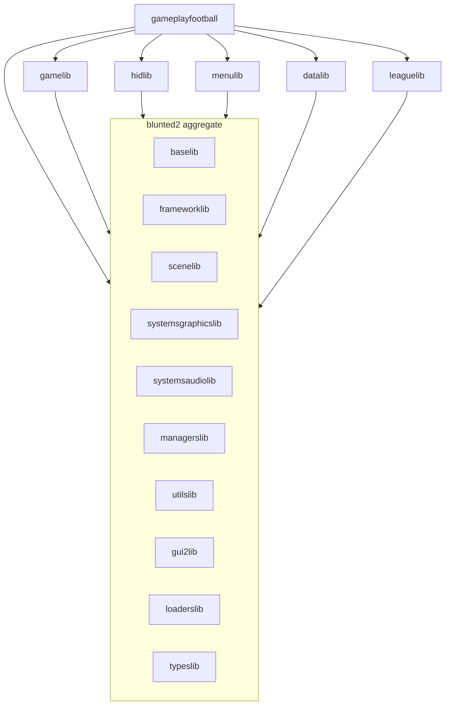
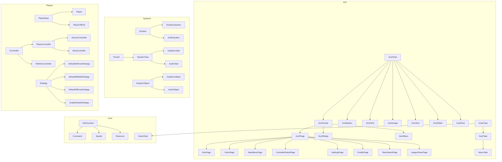

# Architecture Diagrams

## Library Dependencies

```mermaid
graph TD
    exe[gameplayfootball]

    exe --> gamelib
    exe --> hidlib
    exe --> menulib
    exe --> datalib
    exe --> leaguelib
    exe --> blunted2

    gamelib --> blunted2
    hidlib --> blunted2
    menulib --> blunted2
    datalib --> blunted2
    leaguelib --> blunted2

    subgraph blunted2 [blunted2 aggregate]
        baselib
        frameworklib
        scenelib
        systemsgraphicslib
        systemsaudiolib
        managerslib
        utilslib
        gui2lib
        loaderslib
        typeslib
    end
```

## Class Hierarchy

```mermaid
graph TD
    subgraph GUI
        Gui2View --> Gui2Frame
        Gui2Frame --> Gui2Page
        Gui2Frame --> Gui2Dialog
        Gui2Frame --> Gui2Menu
        Gui2View --> Gui2Button
        Gui2View --> Gui2Grid
        Gui2View --> Gui2Image
        Gui2View --> Gui2Text
        Gui2View --> Gui2Slider
        Gui2View --> Gui2Root
        Gui2Page --> IntroPage
        Gui2Page --> OutroPage
        Gui2Page --> MainMenuPage
        Gui2Page --> ControllerSelectPage
        Gui2Page --> SettingsPage
        Gui2Page --> CreditsPage
        Gui2Page --> TeamSelectPage
        Gui2Page --> LeagueTeamPage
        IUserTask --> Gui2Task
        Gui2Task --> MenuTask
    end

    subgraph Systems
        ISystem --> GraphicsSystem
        ISystem --> AudioSystem
        ISystemTask --> GraphicsTask
        ISystemTask --> AudioTask
        ISystemObject --> GraphicsObject
        ISystemObject --> AudioObject
        Thread --> ISystemTask
    end

    subgraph Players
        PlayerBase --> Player
        PlayerBase --> PlayerOfficial
        IController --> PlayerController
        PlayerController --> HumanController
        PlayerController --> ElizaController
        IController --> RefereeController
        Strategy --> DefaultDefenseStrategy
        Strategy --> DefaultMidfieldStrategy
        Strategy --> DefaultOffenseStrategy
        Strategy --> GoalieDefaultStrategy
    end

    subgraph Core
        RefCounted --> Command
        RefCounted --> Spatial
        RefCounted --> Resource
        IUserTask --> GameTask
    end
```
