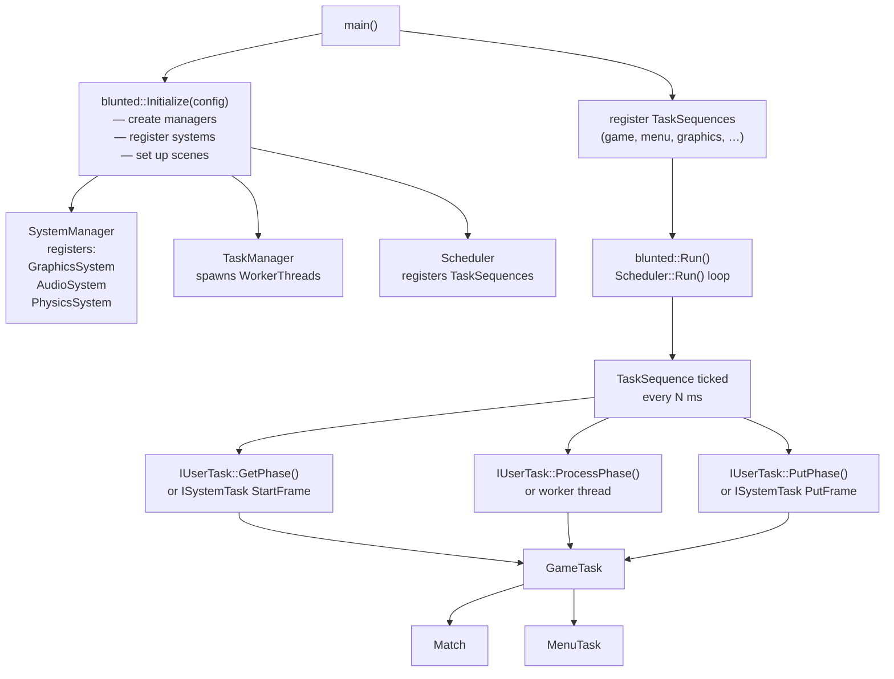
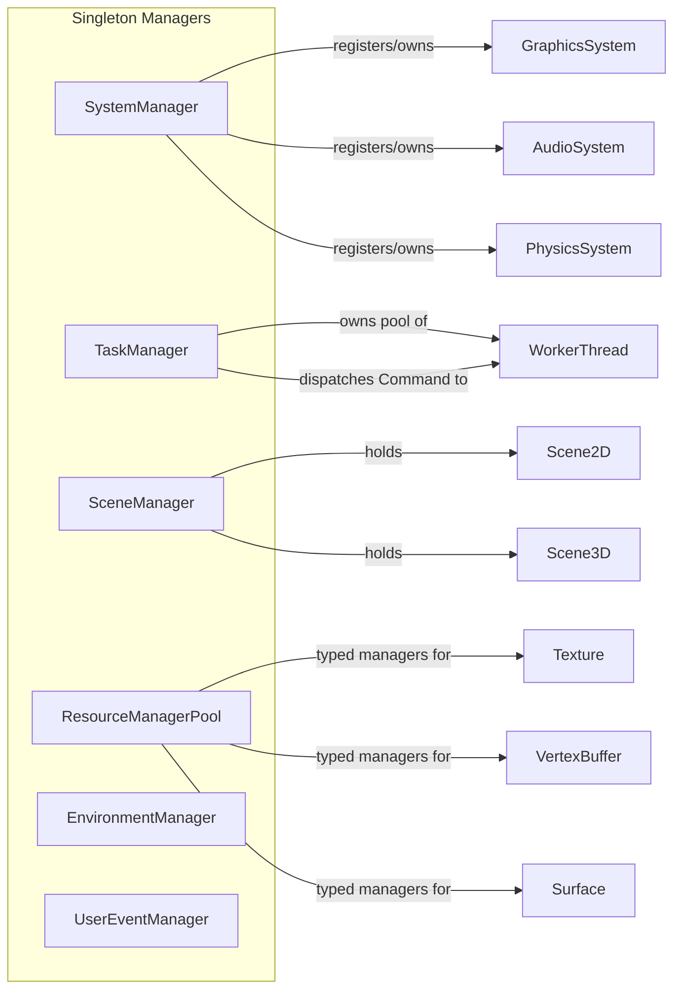
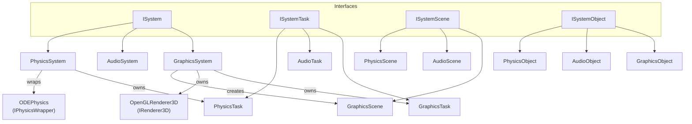
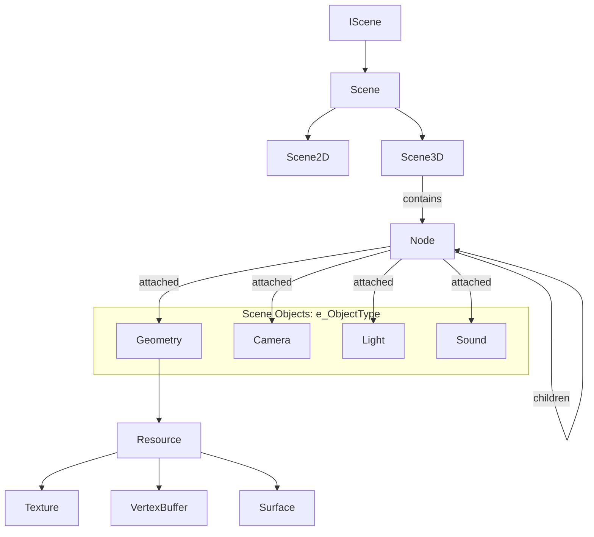
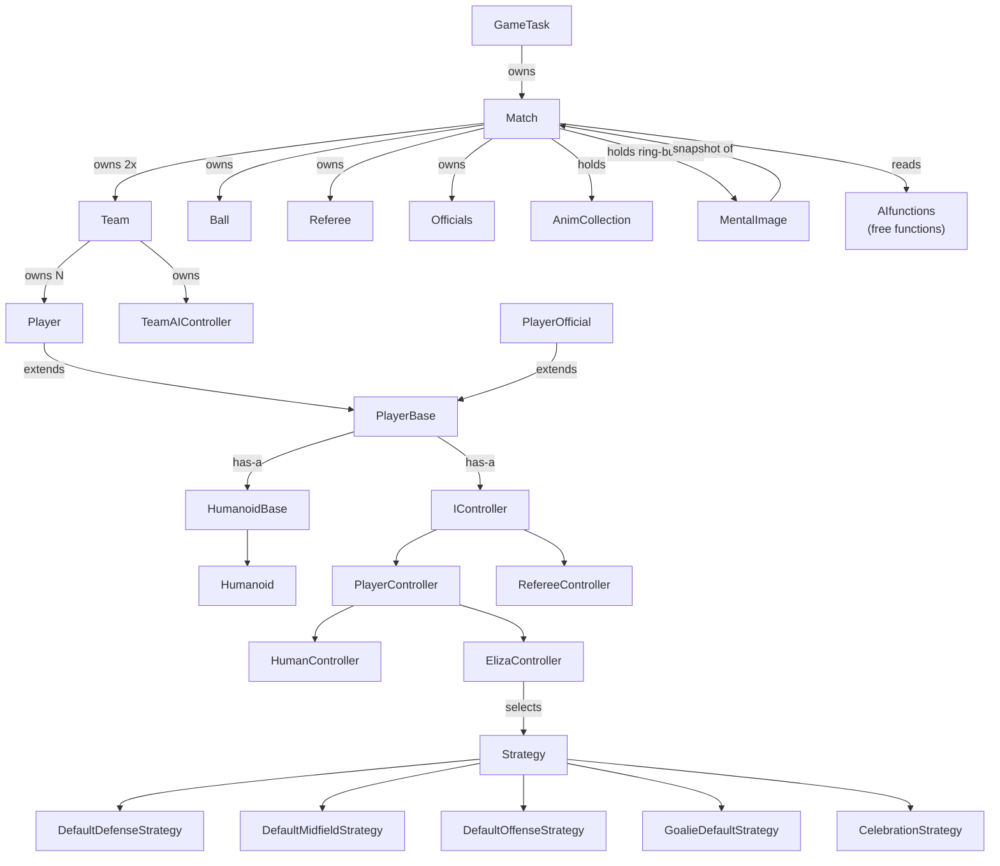
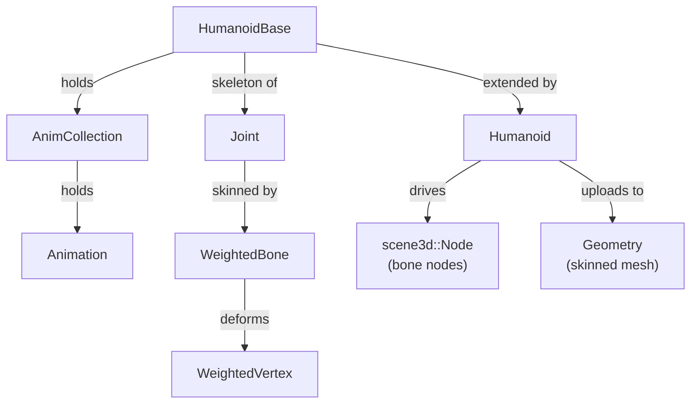
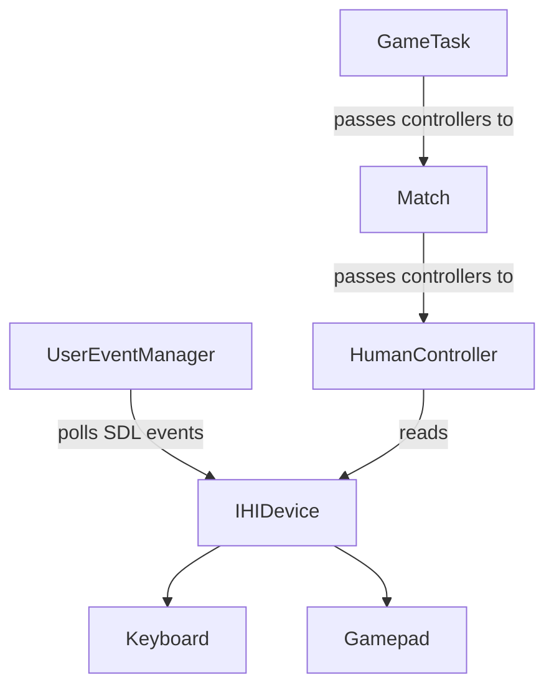
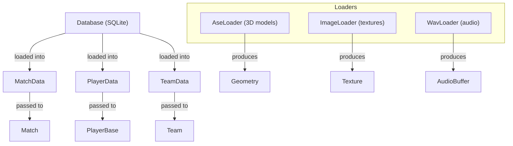

# Architecture Diagrams

## 1. Library Dependencies

---

## 2. Runtime Boot & Game Loop

---

## 3. Manager Singletons

---

## 4. Systems Architecture

---

## 5. Scene Graph

---

## 6. Match Simulation

---

## 7. Humanoid Animation

---

## 8. HID & Input

---

## 9. GUI Class Hierarchy

```mermaid
graph TD
    subgraph Core
        Gui2View --> Gui2Frame
        Gui2Frame --> Gui2Page
        Gui2Frame --> Gui2Dialog
        Gui2Frame --> Gui2Menu
        Gui2View --> Gui2Button
        Gui2View --> Gui2Grid
        Gui2View --> Gui2Image
        Gui2View --> Gui2Text
        Gui2View --> Gui2Slider
        Gui2View --> Gui2Root
    end

    subgraph MainMenuPages
        Gui2Page --> IntroPage
        Gui2Page --> OutroPage
        Gui2Page --> MainMenuPage
        Gui2Page --> ControllerSelectPage
        Gui2Page --> SettingsPage
        Gui2Page --> CreditsPage
        Gui2Page --> TeamSelectPage
    end

    subgraph InGameHUD
        Gui2Page --> GamePage
        Gui2Page --> GameOverPage
        Gui2Page --> PhaseMenuPage
        Gui2View --> Gui2ScoreBoard
        Gui2View --> Gui2Radar
        Gui2View --> Gui2TacticsDebug
        Gui2View --> Gui2PlayerHUD
        Gui2View --> Gui2ReplayMenu
    end

    subgraph LeaguePages
        Gui2Page --> LeaguePage
        Gui2Page --> LeagueCalendarPage
        Gui2Page --> LeagueStandingsPage
        Gui2Page --> LeagueManagementPage
        Gui2Page --> LeagueInboxPage
    end

    IUserTask --> Gui2Task
    Gui2Task --> MenuTask
```

---

## 10. Data Layer

